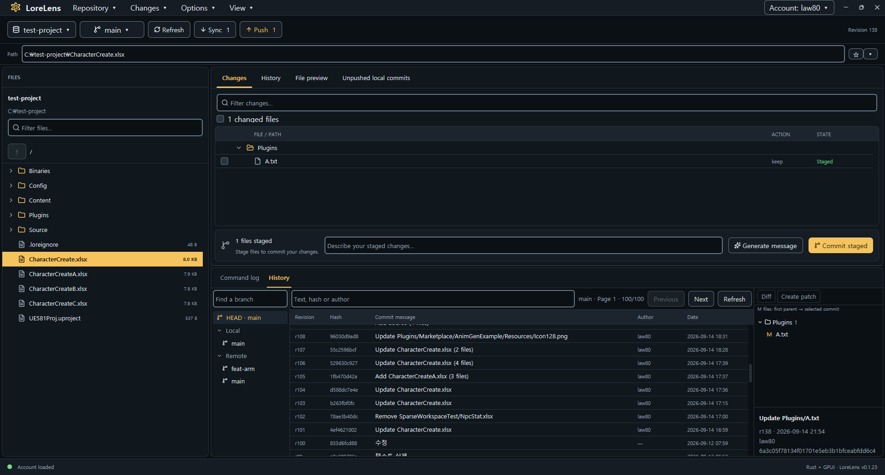

# LoreLens

A local Lore VCS desktop client for Windows, built with Rust and GPUI. Its workspace, pending changes, submitted revisions, and details layout is inspired by P4V.



## Running

Requires stable Rust and the Visual Studio C++ Build Tools / Windows SDK.

```powershell
cd C:\GitHub\lorelens
cargo run -- C:\GitHub\lore
```

The built application is `target\debug\lorelens.exe`. You can pass a folder as a command-line argument or choose one with **Open repository…**. Local file browsing and preview work without the Lore CLI.

## Connecting Lore

The implementation follows the source and CLI event definitions in `C:\GitHub\lore`. This repository is not itself a Lore workspace; existing Lore workspaces and the Lore CLI are required for VCS operations.

```powershell
cd C:\GitHub\lore
cargo build -p lore-client --bin lore
```

The app looks for the Lore CLI in this order: `LORELENS_LORE_BIN`, the bundled platform path (`dist/lore.exe` on Windows and `dis/lore` on macOS), and then `lore` on `PATH`. You can also choose it with **Locate CLI…**. After opening a workspace, **Refresh** displays the result of `lore status --scan --json`.

On Windows, if the Lore CLI cannot be found at startup or when running a command, LoreLens asks whether to install it using:

```powershell
winget install EpicGames.Lore
```

Accepting runs winget in the background and accepts its package and source agreements. After installation, LoreLens locates `lore.exe`, saves its absolute path to the Windows user environment variable `LORELENS_LORE_BIN` and the app settings, and uses it immediately without restarting. Canceling skips installation. Installation or path detection failures appear in Details / Command log; you can also select the executable with **Locate CLI…**.

## Usage

Right-click a file or folder in the left panel and choose `Move…`. Check the source and enter a destination path including the new name. Relative paths are resolved from the repository root. Moving outside the repository and overwriting an existing destination are rejected. Refresh after moving to detect the change.

Use `↑`/`↓` to select an item, `→` to enter a selected folder, and `←` to move to its parent. The repository root has no parent within the workspace.

The top **Push** button sends local commits on the current branch to the remote using the signed-in account (`lore push`). The status is refreshed afterward, and results or errors appear in Details.

Double-clicking a file opens it with the operating system's default application. A single click shows a preview. Double-clicking a folder opens it inside LoreLens.

Use **Clone repository…** to enter a repository URL and absolute destination path. The parent folder must exist, and the destination must be new or empty. On success, the cloned repository opens automatically. The most recent URL and destination values are restored from local settings.

Use **Repository → Create repository…** to create a remote Lore repository and its local workspace. Log in to the server first, then enter the full repository URL (for example, `lores://server:port/project`) and an absolute local destination. The parent folder must exist and the destination must be new or empty. The new repository opens automatically on success; failures appear in Details and the command log.

The create dialog remembers the last URL and destination, including when canceled. Each field offers its ten most recent non-empty values without duplicates, saved across app restarts separately from clone history.

The **Account** button displays the account used by the current workspace (`lore auth info`). Authentication tokens are never displayed. **Sync** runs `lore sync` and refreshes the file list, change status, lock indicators, and branch information. `--reset` and `--force` are not used.

Use `Ctrl` (or `Cmd` on macOS) plus click to add or remove files and folders from the selection. Use `Shift` plus click to select a range. Stage, Unstage, and Diff apply to the selected items; context-menu actions apply to the item that was right-clicked.

Choose `System`, `Light`, or `Dark` from the View menu. `System` follows the operating system appearance, and the selected setting is saved for the next launch.

The file context menu provides Discard for detected changes, **Open Command Window Here**, Explorer/Finder navigation, and Lore Lock/Unlock actions. Failed lock queries are recorded in the command log and can be retried by reopening the menu.

1. Browse folders, search files, and preview text in **Files**.
2. Scan for modified, added, and deleted files with **Refresh**.
3. Use **Diff**, **Stage file**, and **Unstage** in **Pending changes**.
4. Enter a message and use **Commit staged** to create a local commit from all staged changes.
5. Inspect revisions, branches, and file history in **Submitted revisions**, **Branches**, and **File history**.
6. Review results and failures in **Details / Command log**. Use **Copy** to copy the full output.

If an authenticated command fails, log in again with the Lore CLI:

```powershell
cd C:\GitHub\lore
..\lore\target\debug\lore.exe login lores://<url>:41337
```

Refresh uses `--scan` to update Lore's dirty state. Commits are not pushed automatically. Commands run in the background with direct argument passing, without a shell. Duplicate operations are blocked while a command is running.

## Current scope

- Native GPUI UI with Korean IME support and text selection, copy, and paste.
- Local folder browsing and status, staging, commit, diff, history, and branch operations for existing Lore workspaces.
- Switch local branches, create local or remote branches, and merge a selected source branch into the current target branch.
- Conflict-free merges create a local commit automatically; use **Push** to send it remotely. Resolve conflicts with the Lore CLI.
- Folder-by-folder navigation. `.git`, `.lore`, `target`, and entries matched by `.loreignore` are hidden. Search displays up to 2,000 results.
- Previews are limited to 128 KiB, details to 1,500 lines, and command output collection to 16 MiB.
- Ten recent repositories and the selected Lore CLI path are stored in `%LOCALAPPDATA%\LoreLens\settings.json`. The last valid repository is restored on launch; a command-line path takes priority.

## Verification

```powershell
cargo fmt --check
cargo clippy -- -D warnings
cargo test
cargo test -- --include-ignored  # Includes the local VCS integration test when Lore CLI is available
cargo build
```

The main modules are `src/main.rs` (application state), `src/view.rs` and related view modules (UI), `src/backend/` (CLI, filesystem, and ignore handling), `src/input.rs` (GPUI text input), and `src/settings.rs` (persistent settings). See the [GPUI documentation](https://gpui.rs/).

## Obliterate

Right-click a file in the **Files** view or a pending changelist and select **Obliterate…**. After reviewing the repository, file path, and impact, you must enter the confirmation text `OBLITERATE` to execute the operation. Folders, repository metadata, and symbolic links or junctions cannot be selected as targets. Files that have already been deleted locally can still be selected from a pending changelist; Lore determines the actual target based on the current or staged state.

`lore file obliterate --path=<file>` permanently removes the stored content of the specified file and stages the deletion of the local file. This action is irreversible and may affect remote repositories as well as revisions referencing the same content; it does not remove all past versions of the file in a single batch. Commits and pushes are not performed automatically. Permission or CLI errors can be viewed in the Details/Command log, and the status is refreshed after a failure to account for the possibility of partial failure.

## External diff and merge tools

Choose `idea`, `p4merge`, or `TortoiseGitMerge` from Options → Diff / Merge. The selected tool and executable path are shared by diff and merge operations and persist across launches. If the selected tool cannot be found, you will be prompted to locate its executable. Windows executables must be `.exe` or `.com`.

Diff compares the current revision with a copy of the local file. Temporary comparison files remain in the OS temporary directory under `lorelens-diff-*` so existing IDE processes can open them. New files that do not exist in the current revision report an extraction error. Conflict-resolution merge execution is not yet connected.

## Menu layout

- **Repository**: open, clone, and revisit repositories.
- **Changes**: Stage, Unstage, Commit staged, File history, and Pending push.
- **Tools**: select a Diff / Merge tool, locate an executable, use `PATH`, and locate the Lore CLI.
- **View**: choose a theme and open the command log. New installations use **LoreLens Light** or **LoreLens Dark** to match the OS appearance. Both are available under **View → Theme…**, and existing theme preferences are preserved.
- **Account**: log in and display the current account.

The second row contains the repository selector, branch menu, Refresh, Sync, and Push. The file context menu contains Diff, Stage/Unstage, Discard, Move, Explorer/Finder navigation, terminal access, and Lock/Unlock actions.

## Sparse workspace

Open **Repository → Sparse workspace…** to select folders from the repository tree, including folders absent from the local disk. A usable Lore CLI is required. Expanding a folder queries its immediate children; subsequent queries use the initial listing's revision to keep the tree consistent.

Check a folder to include its entire subtree, or uncheck it to exclude it. Child selections can override a parent selection. **All repository folders** includes or excludes the entire view, including root-level files. **Undo selections** restores the selection state from when the dialog opened. Existing comments and rules are preserved, with folder overrides appended on save. Arbitrary wildcard or file-level rules are conservatively shown as **partial / custom rules**, not as a claim that every descendant has the same state. Selecting that folder explicitly overrides those rules within its subtree.

**Save** rereads `.lore/view` (or legacy `.urc/view`) and merges this session's folder selections into its latest contents, preserving external edits and comments. This session's explicit selections take precedence within the selected folders. Repeated LoreLens-generated selection blocks are compacted to their effective settings, including when no new selections were made. Superseded folder choices and choices already covered by a parent are removed. Authored rules and comments remain ordering barriers so cleanup does not change their precedence. A further change detected during saving is rejected; file replacement is atomic. Closing the editor refreshes repository status. Saving does not run sync or delete workspace files; subsequent Lore operations may materialize or remove files according to the view, so review pending changes before syncing. Listing errors can be retried without losing selections.

## Localization

Choose English, 한국어, or 简体中文 from **View → Language**. English is the default. The selection is applied immediately, saved to settings, and restored on the next launch.

- `i18n/en-US.json`: source English catalog.
- `i18n/ko-KR.json`: Korean catalog.
- `i18n/zh-CN.json`: Simplified Chinese catalog.
- `lorelens/src/i18n.rs`: translation lookup, locale switching, and interpolation.

Catalogs are flat JSON files keyed by the English UI text. Placeholder names such as `{count}` and `{path}` must remain unchanged, though their order may change. Missing translations fall back to English, and unknown locale settings fall back to `en-US`. Catalogs are embedded at build time, so changes require a rebuild.

Right-click a file or directory in the left panel and choose **Delete…** to review the target path and permanently delete it. Folder contents are deleted as well, and the Recycle Bin is not used. The file list and repository status are refreshed after completion. Direct deletion of the repository root, metadata, symbolic links, and junctions is blocked.

Right-click a deleted or staged file in the main **Pending changes** list to use **Revert file…**. After confirmation, the file is restored to its current committed state: local edits and staged changes are discarded, and newly added files are deleted. Staged files also show **Unstage…**, which preserves the local changes. The list and repository status are refreshed after completion.
